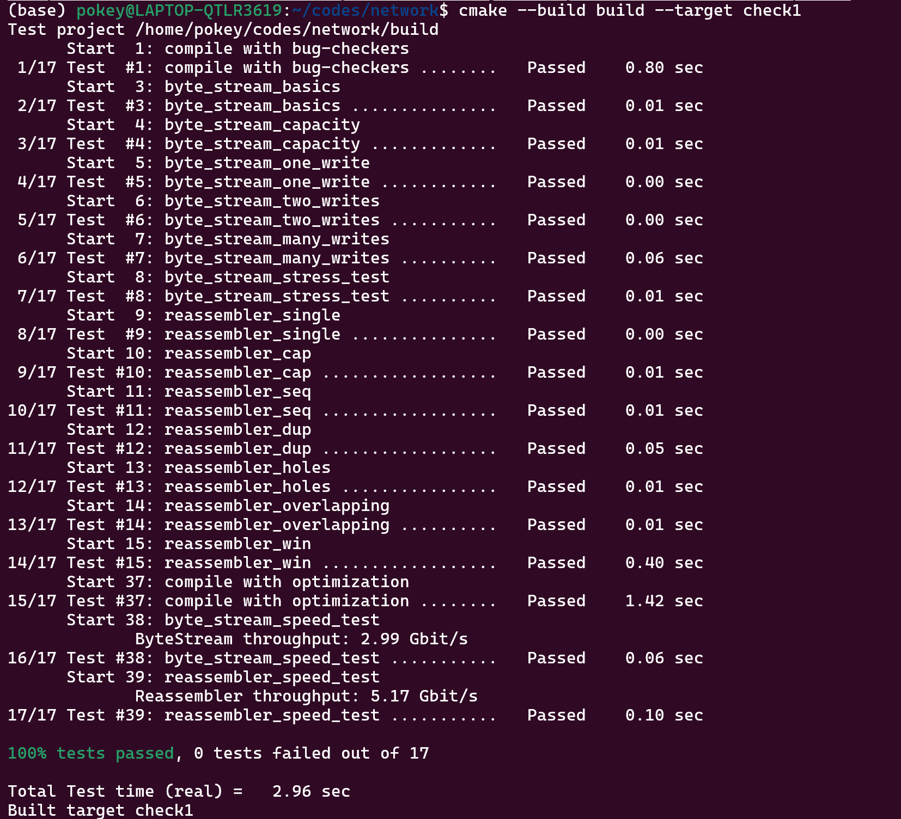

Checkpoint 1 Writeup
====================

My name: 何旭

My ID: 502024330015

## Structure and design

#### reassembler. hh
* I used the ```list``` container to implement the buffer of the assembler, in which the elements' type is ```pair<uint64_t, string>```. The element records the starting index of each string in the buffer and the content of the string.
* The ```unassembled_index``` records the first index of the string that expected to be pushed in the ByteStream.
* 
```
ByteStream output_; // the Reassembler writes to this ByteStream
list<pair<uint64_t, string>> buffer_ {};
uint64_t unassembled_index {};
uint64_t eof_flag = UINT64_MAX;
```

#### reassembler. cc
* First, calculate the starting and ending index of the strings that can be recorded in the current assembler's buffer. Then, compare the starting and ending index of the input string with those of the buffer. Truncate the part of the input string that exceeds the buffer, and for input strings whose index are not within the buffer, directly return.
* Iterate through each element already stored in the buffer, comparing its head (```head_now```)and tail(```tail_now```) index with those of the input string(```first_index and last_index```). Handle the following situations differently.
  1. ```head_now <= first_index && tail_now >= last_index```
   In this case, no further action is needed, directly exit the iteration process.
  2. ```head_now < first_index && tail_now > first_index```
   In this case, erase the overlapping part between the input string and the current element, and modify the ```first_index```.
  3. ```head_now >= first_index && tail_now <= last_index```
   In this case, extract the part of the input string that precedes the current element as a new substring, and insert it into the buffer before the current element. At the same time, keep the part of the input string that follows the current element, and it continues participating in the subsequent iteration.
    ```
    string insert_str = data.substr( 0, head_now - first_index );
    pair<uint64_t, string> inserted( first_index, insert_str );
    buffer_.insert( i, inserted );

    uint64_t erase_len = tail_now - first_index;
    first_index = tail_now;
    data.erase( 0, erase_len );
    ```
  4. ```head_now < last_index && tail_now > last_index```
   In this case, insert the part of the input string that comes before ```head_now``` into the buffer, and break the loop.

* Through the above process, it can be ensured that the non-overlapping part of ```data``` with the existing elements in the buffer has been inserted into the buffer, or that there is still a part of ```data``` that has not been inserted into the buffer but does not overlap with the elements in the buffer.
  If there is still data that has not been inserted into the buffer, directly find the first element in the buffer whose index is greater than that data, and insert the data before that element.

* In the end, check if the index of the first element in the buffer equals ```unassembled_index```. If it does, push the element into bytestream and update ```unassembled_index``` to be the tail index of that element.
  Continue iterating through the subsequent elements in the buffer, performing the same operation.

## Implement challenges
* During the implementation of the reassembler, The biggest challenge is the discussion of edge cases. I chose this method: every time a new string arrives, it is compared with all the elements already in the buffer. If there is an overlapping part, it will be truncated as mentioned above, ensuring that the part of the current string inserted into the buffer is all non-overlapping.
* It was quite difficult to debug, as there was no IDE for debugging, and I could only rely on the result information for troubleshooting. I used ChatGPT to help me analyze the cause of the errors for debugging, and this also took me quite a bit of time.
  
## Experimental results and performance

