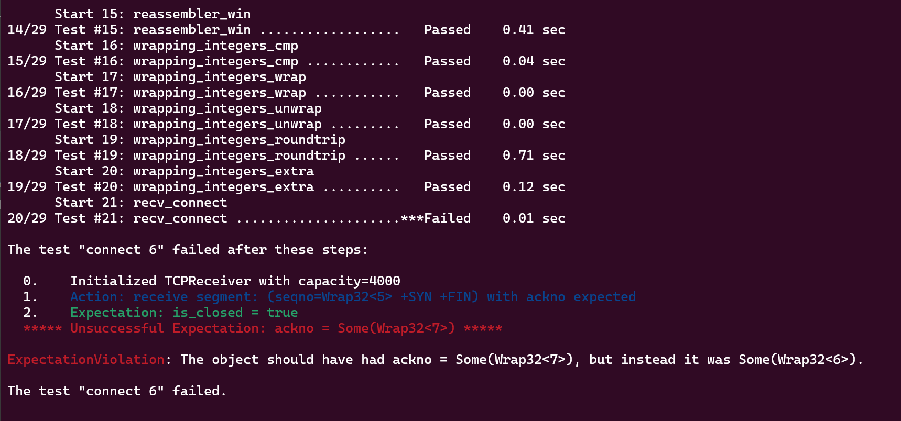

Checkpoint 1 Writeup
====================

My name: 何旭

My ID: 502024330015

## Structure and design

#### wrapping_integers. cc
* In function ```Wrap32 Wrap32::wrap( uint64_t n, Wrap32 zero_point )```, I use ```n + zero_point.raw_value_``` to convert absolute seqno to seqno. And I map it to uint32_t type through a modulo operation.
* In function ```uint64_t Wrap32::unwrap( Wrap32 zero_point, uint64_t checkpoint ) const```, I calculated its minimum possible value using ```((uint64_t)raw_value_ + wrap_modulus - zero_point.raw_value_) % wrap_modulus```. Initially, I used a while loop to make it approach the checkpoint, but this approach leads to a timeout.Therefore, I find the approximate range of the checkpoint through modulo operation. Then, based on this range, I search for the final required value.
```
  uint64_t start = checkpoint/wrap_modulus;
  uint64_t candidate1 = min_value + start * wrap_modulus;
  uint64_t candidate2 = candidate1;
  if(candidate1 > checkpoint){
    if(start == 0)
      return candidate1;
    candidate2 = candidate1 - wrap_modulus;
    if(candidate1 - checkpoint > checkpoint - candidate2)
      return candidate2;
    else 
      return candidate1;  
  }
  else{
    candidate2 = candidate1 + wrap_modulus;
    if(checkpoint - candidate1 > candidate2 - checkpoint)
      return candidate2;
    else 
      return candidate1;
  }
  ```

#### tcp_receiver. hh
* In ```class TCPReceiver``` I created two private member variables.
```
private:
  Reassembler reassembler_;
  Wrap32 isn_{0};
  bool already_syn{false};
```
The ```isn_``` is the Initial Sequence Number (ISN), and I use ```already_syn``` to record whether the syn has been received.

#### tcp_receiver. cc
* ```void TCPReceiver::receive( TCPSenderMessage message )```
  1. it first identifies the SYN synchronization signal and sets the ```already_syn``` and ```isn_``` accordingly.
  ```
  if(!already_syn && !message.SYN)
      return;
    if (message.SYN && !already_syn) {
      isn_ = message.seqno;
      already_syn = true;
    }
  ```
  2. Then, it calculates the absolute sequence number.
  ```
  uint64_t absolute_seqno = message.seqno.unwrap(isn_, writer().bytes_pushed());
  ```

  3. Finally, it inserts it into the reassembler, with the key point being the handling of the SYN signal. And the ```stream index = absolute_seqno + uint64_t( message.SYN ) - 1``` 
  ```
  reassembler_.insert(absolute_seqno + uint64_t( message.SYN ) - 1, 
  message.payload, message.FIN);
  ```

* ```TCPReceiverMessage TCPReceiver::send() const```
  1. First, calculate the maximum available space of the writer stream
   ```
   uint16_t available = writer().available_capacity() > UINT16_MAX? 
   UINT16_MAX: uint16_t(writer().available_capacity());
   ```
  2. Calculate the value of ackno, and check whether the Writer is closed.
    ```
    uint64_t ackno = writer().bytes_pushed()+1+uint64_t(writer().is_closed());
    ```
  3. Finally, send different messages based on whether ```already_syn == true```
   ```
   if(already_syn)
    return TCPReceiverMessage{Wrap32::wrap(ackno,isn_),available,writer().has_error()};
  else 
    return TCPReceiverMessage{nullopt,available,writer().has_error()};
   ```

## Implement challenges
* During the implementation of ```uint64_t Wrap32::unwrap( Wrap32 zero_point, uint64_t checkpoint ) const```, using a while loop causes a timeout.

To improve this, I directly find candidate values close to the checkpoint through modulo operation.

* During the testing of the tcp_receiver

I realized that the issue lies in the send() function.And it is beacause I did not take into account whether the Writer is closed.
  
## Experimental results and performance
#### Wrap32


#### tcp_receiver


