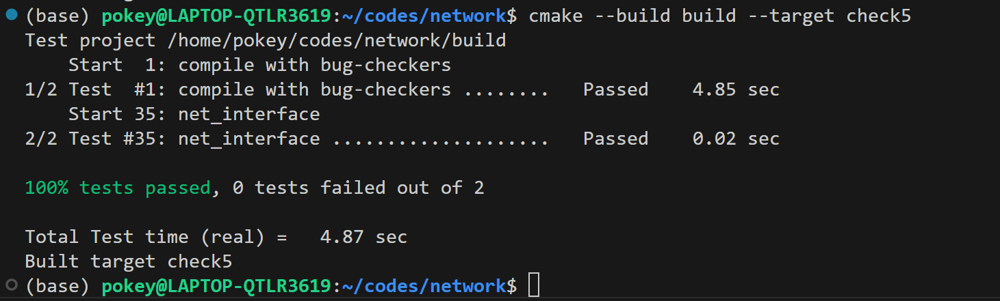

Checkpoint 5 Writeup
====================

My name: 何旭

My ID: 502024330015

## Structure and design

#### network_interface.hh
* I create a new class ```class arp_item```, which is used to record the entries in the ARP table.
```cpp
public:
  EthernetAddress eth_addr;
  size_t ttl;
```

* In ```class NetworkInterface``` I created some private member variables.
```cpp
private:
  unordered_map<uint32_t, arp_item> arp_table_ {};
  unordered_map<uint32_t, size_t> arp_5_ {};
  unordered_multimap<uint32_t, InternetDatagram> arp_ip_waiting_ {};
```
1. The ```arp_table_``` is the ARP table, and its entries are a mapping from IP addresses to the aforementioned ```arp_item```
2. The ```arp_5_``` is used to record the lifespan of ARP messages that have been sent but not yet received a reply. The initial value of the entry is set to 5ms, and it gets updated with each use of the ```void tick( size_t ms_since_last_tick )``` function. Its purpose is to prevent sending the same ARP message if another one with the same destination is sent within 5ms.
3. The ```arp_ip_waiting_``` is used to record InternetDatagrams that are waiting to be sent, but at the moment, the ARP information for the destination address is not yet available.Because it may contain multiple InternetDatagrams with the same IP address, I use ```unordered_multimap``` as the container.

#### nework_interface.cc
* ```void NetworkInterface::send_datagram( const InternetDatagram& dgram, const Address& next_hop )```
  First, I check if the address is already in the current ARP table by looking up next_hop.
1. In the first case, if the corresponding entry for the address is found in the ARP table,based on the information in the table, retrieve the destination ethernet address.Then, add the ```EthernetHeader``` to the ```InternetDatagram``` to form an ```EthernetFrame```, and send it out.
```cpp
    EthernetAddress dst = it->second.eth_addr;
    EthernetAddress src = ethernet_address_;
    EthernetHeader header { .dst = dst, .src = src, .type = EthernetHeader::TYPE_IPv4 };
    EthernetFrame frame { .header = header, .payload = serialize( dgram ) };
    transmit( frame );
```
2. In another case, if the corresponding entry for the address is not found in the ARP table, we should send an ARP request.If an ARP request for the same address has been sent within the last 5ms, there is no need to send it again.Finally, we need to place the ```InternetDatagram``` into ```arp_ip_waiting_``` to record it.
```cpp
if ( arp_5_.find( next_address ) == arp_5_.end() ) {
  EthernetAddress target_eth = EthernetAddress {};
  ARPMessage arp { .opcode = ARPMessage::OPCODE_REQUEST,
                   .sender_ethernet_address = ethernet_address_,
                   .sender_ip_address = ip_address_.ipv4_numeric(),
                   .target_ethernet_address = target_eth,
                   .target_ip_address = next_address };
  EthernetAddress dst = ETHERNET_BROADCAST;
  EthernetAddress src = ethernet_address_;
  EthernetHeader header { .dst = dst, .src = src, .type = EthernetHeader::TYPE_ARP };
  EthernetFrame frame { .header = header, .payload = serialize( arp ) };
  transmit( frame );
  arp_5_.emplace( next_address, 5000 );
}
arp_ip_waiting_.emplace( next_address, dgram );
```
<br />

* ```void NetworkInterface::recv_frame( const EthernetFrame& frame )```
1. If the received frame's destination address is neither the broadcast address nor the Ethernet address of the receiver, it should be returned immediately. And update the contents of the ```arp_table_``` accordingly.
```cpp
  if ( frame.header.dst != ETHERNET_BROADCAST && frame.header.dst != ethernet_address_ )
    return;
```
2. If the received frame is of ```EthernetHeader::TYPE_IPv4```, it can be received directly. If the frame is of ```EthernetHeader::TYPE_ARP```, we need to determine whether it is a request or a reply.
```cpp
if ( frame.header.type == EthernetHeader::TYPE_IPv4 ) {
    InternetDatagram datagram;
    if ( !parse( datagram, frame.payload ) )
      return;
    datagrams_received_.emplace( datagram );
}else if ( frame.header.type == EthernetHeader::TYPE_ARP ) {
    ARPMessage arp_msg;
    if ( !parse( arp_msg, frame.payload ) )
      return;
    uint32_t src_ip = arp_msg.sender_ip_address;
    uint32_t dst_ip = arp_msg.target_ip_address;
    EthernetAddress src_eth = arp_msg.sender_ethernet_address;
    arp_table_[src_ip] = { src_eth, 30000 };
    ...
}
```
3. If it is an ARP request and the this interface is the target host, then send an ARP reply in response.
```cpp
if ( arp_msg.opcode == ARPMessage::OPCODE_REQUEST && dst_ip == ip_addressipv4_numeric() ) {
  ARPMessage arp_reply { .opcode = ARPMessage::OPCODE_REPLY,
                         .sender_ethernet_address = ethernet_address_,
                         .sender_ip_address = ip_address_.ipv4_numeric(),
                         .target_ethernet_address = src_eth,
                         .target_ip_address = src_ip };

  EthernetHeader header { .dst = src_eth, .src = ethernet_address_, 
  .type = EthernetHeader::TYPE_ARP };
  EthernetFrame send_frame { .header = header, .payload = serialize( arp_reply ) };
  transmit( send_frame );
}
```

4. If it is an ARP reply, the interface will update ```arp_table_``` and ```arp_5_```, then send out all the datagrams in ```arp_ip_waiting_``` that are waiting for the corresponding Ethernet address.
```cpp
else if ( arp_msg.opcode == ARPMessage::OPCODE_REPLY ) {
  arp_table_[src_ip] = { src_eth, 30000 };
  arp_5_.erase( src_ip );
  for ( auto it = arp_ip_waiting_.begin(); it != arp_ip_waiting_.end(); ++it ) {
    if ( it->first == src_ip )
      send_datagram( it->second, Address::from_ipv4_numeric( src_ip ) );
  }
  arp_ip_waiting_.erase( src_ip );
}
```
<br />

* ```void NetworkInterface::tick( const size_t ms_since_last_tick )```
1. First, update the ARP table by removing any entries whose lifespan is less than or equal to 0.
```cpp
for ( auto iter = arp_table_.begin(); iter != arp_table_.end(); ) {
  if ( iter->second.ttl <= ms_since_last_tick )
    iter = arp_table_.erase( iter );
  else {
    iter->second.ttl -= ms_since_last_tick;
    ++iter;
  }
}
```
2. Then, update ```arp_5_``` by retransmitting any entries whose lifespan is less than or equal to 0.
```cpp
for ( auto iter = arp_5_.begin(); iter != arp_5_.end(); ++iter ) {
  if ( iter->second <= ms_since_last_tick ) {
    ARPMessage arp_request { .opcode = ARPMessage::OPCODE_REQUEST,
                             .sender_ethernet_address = ethernet_address_,
                             .sender_ip_address = ip_address_.ipv4_numeric(),
                             .target_ethernet_address = {},
                             .target_ip_address = iter->first };

    EthernetHeader header {
      .dst = ETHERNET_BROADCAST, .src = ethernet_address_, .type = EthernetHeader::TYPE_ARP };
    EthernetFrame frame { .header = header, .payload = serialize( arp_request ) };
    transmit( frame );
    iter->second = 5000;
  } else
    iter->second -= ms_since_last_tick;
}
```
<br />

## Implement challenges
* During the implementation of ```void NetworkInterface::recv_frame( const EthernetFrame& frame )```, I had a doubt about whether I need to update the ```arp_table_```. Initially, I thought updates were only needed when receiving an ARP reply, but during debugging, I encountered this issue.
```bash
The test "learn from ARP request" failed after these steps:

  0.    Initialized std::pair<NetworkInterface, std::shared_ptr<FramesOut> > with 
  eth=8e:fe:79:1e:a0:e3, ip=5.5.5.5
  1.    Action: frame arrives (dst=ff:ff:ff:ff:ff:ff src=fe:ad:08:1b:e5:f4 type=ARP 
  payload: opcode=REQUEST, sender=fe:ad:08:1b:e5:f4/10.0.1.1, 
  target=00:00:00:00:00:00/5.5.5.5)
  2.    Expectation: frame transmitted (dst=fe:ad:08:1b:e5:f4 src=8e:fe:79:1e:a0:e3 type=ARP 
  payload: opcode=REPLY, sender=8e:fe:79:1e:a0:e3/5.5.5.5, target=fe:ad:08:1b:e5:f4/10.0.1.1)
  3.    Expectation: no frame transmitted
  4.    Action: request to send datagram (to next hop 10.0.1.1): IPv4 len=25 protocol=6 
  ttl=128 src=5.6.7.8 dst=13.12.11.10
  ***** Unsuccessful Expectation: frame transmitted (dst=fe:ad:08:1b:e5:f4 src=8e:fe:79:1e:a0:e3 
  type=IPv4 payload: IPv4 len=25 protocol=6 ttl=128 src=5.6.7.8 dst=13.12.11.10 
  payload="hello") *****

ExpectationViolation: NetworkInterface sent a different Ethernet frame than was expected: 
actual={dst=ff:ff:ff:ff:ff:ff src=8e:fe:79:1e:a0:e3 type=ARP payload: opcode=REQUEST, 
sender=8e:fe:79:1e:a0:e3/5.5.5.5, target=00:00:00:00:00:00/10.0.1.1}
```
  
## Experimental results and performance


