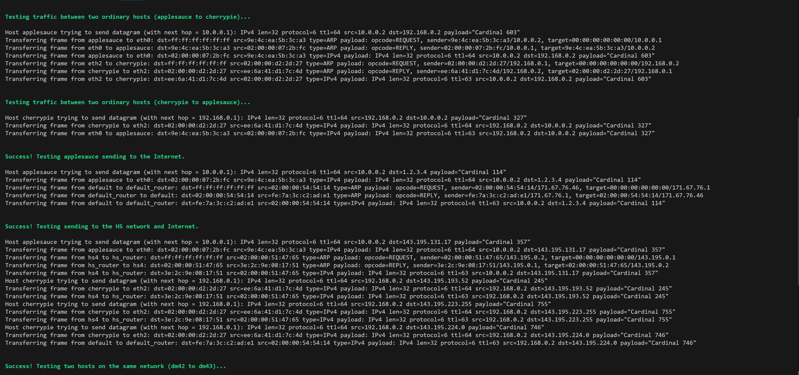
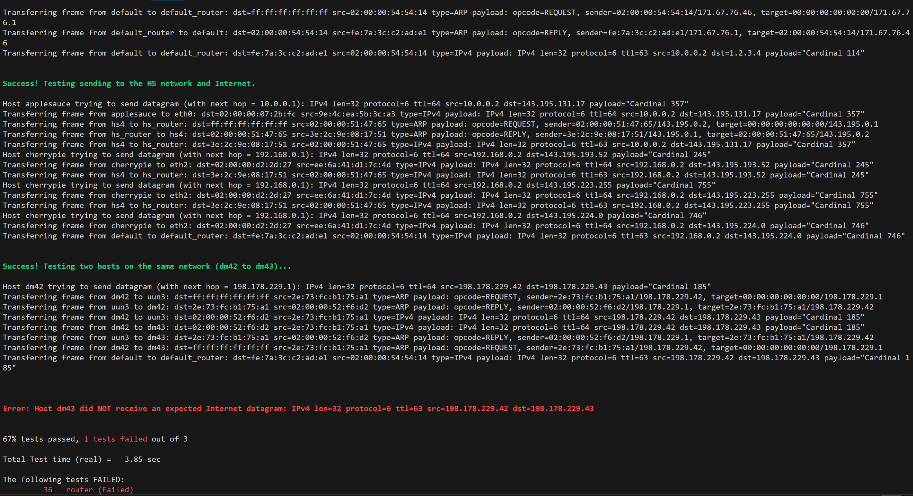

Checkpoint 6 Writeup
====================

My name: 何旭

My ID: 502024330015

## Structure and design

#### router.hh
* I create a new class ```class router_item```, which is used to record the entries in the router table.  I will use ```set``` as the container, so I have overloaded the '<' operator to sort the entries in the table in descending order based on their prefix lengths.
```cpp
public:
  uint32_t route_prefix;
  uint8_t prefix_length;
  optional<Address> next_hop;
  size_t interface_num;
  router_item(uint32_t rp, uint8_t pl, std::optional<Address> nh, size_t in)
        : route_prefix(rp), prefix_length(pl), next_hop(nh), interface_num(in) {}
  bool operator<(const router_item& other) const {
    return prefix_length > other.prefix_length; 
  }
```

* In ```class Router``` I created a member variable.
```cpp
private:
  set<router_item> router_table_ {};
```
It is used to maintain the routing table in the router.

#### router. cc
* ```void Router::add_route( const uint32_t route_prefix,const uint8_t prefix_length,const optional<Address> next_hop,const size_t interface_num )```
Directly add entry information to the routing table.
```cpp
router_table_.insert({route_prefix,prefix_length,next_hop,interface_num});
```
<br />

* ```void Router::route()```
1. First, iterate through all the interfaces of the router, and retrieve the datagrams received on the current interface.
```cpp
for (auto& interfacePtr : _interfaces) {
  auto& datagram_all = interfacePtr->datagrams_received();
    ...
}
```

1. Read the datagrams one by one, and perform a longest prefix match against the routing table.
```cpp
while(!datagram_all.empty()){
  InternetDatagram datagram = datagram_all.front();
  datagram_all.pop();
  uint32_t dst = datagram.header.dst;
  ...
}
```

1. Directly traverse the routing table from front to back; the first match found is the result of the longest prefix match.
```cpp
auto router_it = router_table_.begin();
for(; router_it != router_table_.end(); ++ router_it){
  uint32_t mask = ~(((uint64_t)1 << (32 - router_it->prefix_length)) - 1);
  if((router_it->route_prefix & mask) == (dst & mask))
    break;
}
```

1. Check whether a matching entry is found in the routing table, and decrement the TTL by one. Then, discard unmatched datagrams and those with a TTL of 0.
```cpp
if(router_it == router_table_.end())
  continue;

datagram.header.ttl--;
if(datagram.header.ttl == 0)
  continue;
datagram.header.compute_checksum();
```

5. Finally, transmit the datagrams that match and have a TTL greater than 0 through the interface indicated by the routing table.
```cpp
Address next_addr = router_it->next_hop.has_value()? 
router_it->next_hop.value() : Address::from_ipv4_numeric(dst);
interface(router_it->interface_num)->send_datagram(datagram, next_addr);
```
<br />

## Remaining Bugs
I encountered a problem in one of the test cases, but I’ve tried many methods and still couldn’t solve it.
The issue occurs in the communication between dm2 and dm3 within the same network.
* ARP Resolution Process
1. dm42 sends an ARP request to the broadcast address, requesting the MAC address for the next hop 198.178.229.1.

2. uun3, acting as the ARP responder, replies with the MAC address for 198.178.229.1: 02:00:00:50:26:df.

3. After receiving the ARP reply, dm42 encapsulates the IPv4 datagram in an Ethernet frame, with the destination MAC address set to 02:00:00:50:26:df, which is the MAC address of the next-hop router.

This process is correct and has no issues.

* Data Frame Transmission Process
1. dm42 sends the data frame to uun3.
2. uun3 didn't forwards the frame to dm43.

I tried rechecking my ```router``` function, and there are no issues with communication between hosts on different networks. However, I couldn’t find the reason why received datagrams cannot be forwarded.

  
## Experimental results and performance
It didn’t pass all the test cases.


